# System Architecture

This document describes the multi-agent system architecture for the **Sustainable Campus Resource Allocation Agent** project.

## System Block Diagram

The project is structured as a collection of autonomous agents communicating via an in-memory message bus environment.

```mermaid
graph TD
    classDef env fill:#1e1e2e,stroke:#89b4fa,stroke-width:2px;
    classDef agent fill:#313244,stroke:#a6adc8,stroke-width:1px;
    classDef manager fill:#11111b,stroke:#a6e3a1,stroke-width:2px;

    Env[CampusEnvironment Message Bus]:::env
    CA[Classroom Agent]:::agent
    LA[Laboratory Agent]:::agent
    HA[Hostel Agent]:::agent
    EMA[Energy Manager Agent]:::manager

    CA -->|1. Submit Request| Env
    LA -->|1. Submit Request| Env
    HA -->|1. Submit Request| Env
    
    Env -->|2. Dispatch Requests| EMA
    EMA -->|3. Run Policy solver| EMA
    EMA -->|4. Return Allocations| Env
    
    Env -->|5. Deliver Allocations| CA
    Env -->|5. Deliver Allocations| LA
    Env -->|5. Deliver Allocations| HA

    CA -->|6. Confirm Satisfaction| Env
    LA -->|6. Confirm Satisfaction| Env
    HA -->|6. Confirm Satisfaction| Env
    Env -->|7. Finalize Step Metrics| EMA
```

## Agent Entities

### 1. ClassroomAgent
- **Domain**: Lectures halls and department classrooms.
- **Demand Driver**: Academic hour schedules, occupancy counts, temperature deviations (driving heating/ventilation load).
- **Core Functionality**: Forecasts upcoming hour demand. If a machine learning model is trained, it feeds historical request records, occupancy, holiday conditions, and temp details into the Random Forest regressor. Otherwise, it falls back to a structural physics-based demand equation.

### 2. LaboratoryAgent
- **Domain**: Research computing centers and laboratory hubs.
- **Demand Driver**: Computing servers, experiment equipment ratings, baseload equipment (e.g. cleanroom venting).
- **Core Functionality**: Tracks active hardware and uses a rolling average forecast model to predict next-hour load surges.

### 3. HostelAgent
- **Domain**: Student housing and residential areas.
- **Demand Driver**: Dorm occupancy, time-of-day peak load behaviors (6 AM - 9 AM morning prep, 5 PM - 11 PM student return).
- **Core Functionality**: Calculates student comfort metrics and efficiency profiles. During holiday seasons, classroom demand decays, but hostel load rises due to daytime student occupancy.

### 4. EnergyManagerAgent
- **Domain**: Campus microgrid coordinator.
- **Control Interface**: Dispatches hourly power allocations based on available grid capacity and constraints.
- **Policies**:
  1. **Equal Proportion**: Fair sharing where curtailment scales demands uniformly.
  2. **Priority Rule**: Laboratory research servers preserved first, then classrooms, and hostel comfort scaled down last.
  3. **Game-Theoretic solver**: Dynamically constructs a multi-player payoff matrix and maps the Nash Equilibrium.
  4. **Reinforcement Learning selection**: Evaluates state context and maps policy decisions using Q-Learning.
