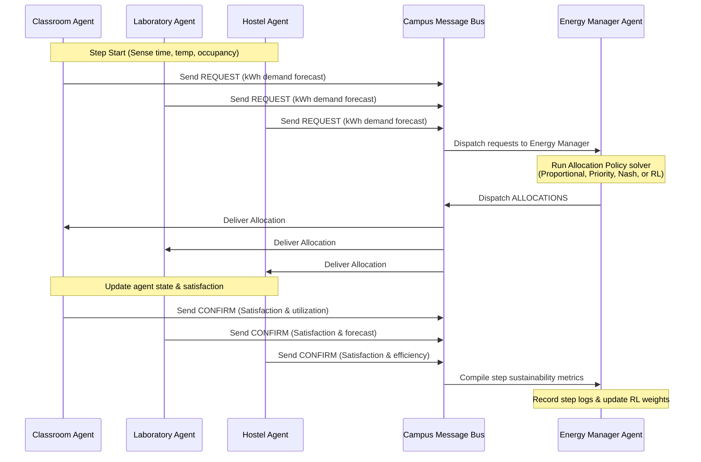

# Project Guide: Explanation, Installation, & Implementation

This guide provides a comprehensive explanation of the **Sustainable Campus Resource Allocation Agent** project, details how to run the codebase, and walks through the underlying math, architecture, and implementation details.

---

## 1. Core Concepts & Explanation

### The Problem
In a smart-campus microgrid, multiple facilities (Classrooms, Laboratories, and Hostels) consume electrical energy from a shared grid with limited hourly capacity. When the total energy request exceeds capacity, conflicts arise. Over-allocation leads to grid failure (brownouts), whereas under-allocation reduces occupant comfort or halts academic research.

This project solves this conflict by combining:
1. **Multi-Agent Simulation**: Modeling each facility as an autonomous actor bidding for energy.
2. **Game Theory**: Framing resource sharing as a non-cooperative game to calculate stable Nash Equilibrium strategies.
3. **Reinforcement Learning**: Operating a microgrid policy controller that learns when to conserve energy and when to prioritize specific agents.
4. **Machine Learning**: Forecasting facility load using Random Forest models trained on 365 days of synthetic hourly campus data.

---

## 2. System Architecture

The microgrid uses an **Agent-Environment-Message** architecture:



---

## 3. How to Run the Project

Follow these steps to set up and run the Streamlit dashboard on your computer:

### Prerequisites
- Python 3.12 (or higher) installed.
- Git installed.

### Setup and Execution
1. **Open PowerShell / Command Prompt** and navigate to your Desktop project folder:
   ```powershell
   cd "C:\Users\Admin\Desktop\sustainable-campus-resource-allocation-agent"
   ```

2. **Create a Python Virtual Environment**:
   ```powershell
   python -m venv venv
   ```

3. **Activate the Virtual Environment**:
   - **On Windows**:
     ```powershell
     .\venv\Scripts\activate
     ```
   - **On macOS/Linux**:
     ```bash
     source venv/bin/activate
     ```

4. **Install Dependencies**:
   ```powershell
   pip install -r requirements.txt
   ```

5. **Run the Streamlit Dashboard**:
   ```powershell
   streamlit run src/sustainable_campus/app.py
   ```
   *Note: On your first startup, the app will automatically generate the 8,760-hour synthetic load dataset and train the Random Forest and Linear Regression models. This happens only once.*

6. **Run the Unit Test Suite**:
   ```powershell
   pytest --cov=src --cov-config=.coveragerc
   ```

---

## 4. Implementation Details

Here is how each module is implemented inside the `src/sustainable_campus/` package:

### A. The Agent System (`src/sustainable_campus/agents/`)
- **`classroom_agent.py`**: Predicts HVAC loads using the deviations between the outside temperature and standard comfort range (22.5°C) scaled by the number of students.
- **`laboratory_agent.py`**: Combines baseline server loads with variable machine loads (e.g. servers running high-performance computations).
- **`hostel_agent.py`**: Implements temporal multipliers to capture peak occupant hours (mornings and evenings) and increases baseline requests on holidays when students stay inside.
- **`energy_manager_agent.py`**: Executes the allocation formulas and translates resource savings into avoided $CO_2$ emissions and cost savings in USD.

### B. Game Theory Module (`src/sustainable_campus/game_theory/`)
- **`utility.py`**: Implements the agent utility formula:
  $$Utility = w_1 \cdot Satisfaction + w_2 \cdot Sustainability - w_3 \cdot Cost$$
- **`payoff_matrix.py`**: Dynamically creates a 3D matrix where each agent evaluates their payoffs across 3 strategies: **Conservative** (requests $0.7 \times$ nominal load), **Normal** ($1.0 \times$), and **Aggressive** ($1.3 \times$).
- **`nash_equilibrium.py`**: Performs grid searches over the matrix. If a Pure Nash Equilibrium does not exist, it falls back to the profile maximizing **Social Welfare** (the sum of all utilities).

### C. Reinforcement Learning Module (`src/sustainable_campus/ai/`)
- **`q_learning.py`**: Implements tabular Q-learning. Discretizes continuous metrics (remaining grid energy, sum of requests, daily budget, and hour) into discrete state bins.
- The agent updates its Q-table at each step using the temporal difference formula:
  $$Q(s, a) \leftarrow Q(s, a) + \alpha \left[ R + \gamma \max_{a'} Q(s', a') - Q(s, a) \right]$$
- **Actions**:
  - `0`: Equal Proportional Allocation
  - `1`: Priority Allocation (Lab > Classroom > Hostel)
  - `2`: Game Theory (Nash Equilibrium allocation)
  - `3`: Eco Conservation (Proportionally scales down requests, capping total load at 80% capacity)
